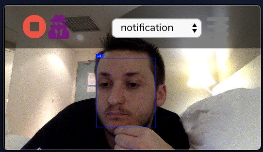

# Anti Shoulder Surfing Attack Platform (ASSAP)

[](https://travis-ci.org/assap-org/assap)
[](https://ci.appveyor.com/project/jiep/assap)


> ASSAP is a multiplatform tool whose aim is to stablish deffensive measures against shoulder surfing attack, technique used for getting confidential information.

> The application has different security measures that can be configured by the users depending on the moment of use. ASSAP is designed to be simple to use so that anyone without knowledge can activate and use it, preventing other people from obtaining their confidential data such as passwords, bank accounts, private data, etc.

<p align="center">
 
</p>

## Features

> The size of the application window is small in order not to disturb user work. Furthermore, it is draggable to place it where least bothers in each moment.

<p align="center">
 
</p>

> The user will have ASSAP window over the other ones to know what is happening behind him.

<p align="center">
 
</p>

> The application can be stopped if the user does not need the security feature.

<p align="center">
 
</p>

## Actions

When the Shoulder Sourfing Attack is detected, the tool executes an action. There are several actions that can be configured, as shown below:

1. Reduce Brightness
2. Lock Screen
3. Notification

<p align="center">
 
</p>

## Examples

* The application detects the faces in different positions and even if someone is hidden behind a hand.

<p align="center">
 
 
 
 
</p>


* Notification sent after detecting shoulder surfing.

<p align="center">
 
</p>

## Getting Started

These instructions will get you a copy of the project up and running on your local machine.

### Prerequisites

It's necessary to have `node` (>9) and `npm`(>5) installed.


* [Node and NPM](https://docs.npmjs.com/downloading-and-installing-node-js-and-npm)


### Installing

#### Dependencies installation

```
npm install
```

#### How to run

```
npm run electron:serve
```

#### How to build
```
npm run electron:build
```

## Extending actions

For implementing new actions it is necessary to modify the file `src/utils/actions.js`.

1. Add the action name to the list `this.availableActions`.
2. Create one the function with the funcionallity to launch the action.
3. Add the function to the `executeAction()` function.
4. If it's necessary, create a function to reverse the action and add it to the `reverseAction()` function.

## Built with

* [Electron](https://electronjs.org) - The Framework used for creating the multiplatform app
* [VueJS](https://vuejs.org) - Progressive JavaScript Framework
* [PugJS](https://pugjs.org) - Template Engine
* [SASS](https://sass-lang.com) - CSS extension language
* [Face-api.js](https://github.com/justadudewhohacks/face-api.js) - Used for face detenction


## Authors

<p align="center">
 
</p>

* **Nerea Sainz De La Maza** ([@nereasainzdelamaza](https://github.com/nereasainzdelamaza))
* **José Ignacio Escribano** ([@jiep](https://github.com/jiep))
* **Jorge Cuadrado Sáez** ([@jorcuad](https://github.com/jorcuad))
* **Ruth González Novillo** ([@RuthGnz](https://github.com/RuthGnz))


## License

This project is licensed under the MIT License - see the [LICENSE](LICENSE) file for details
